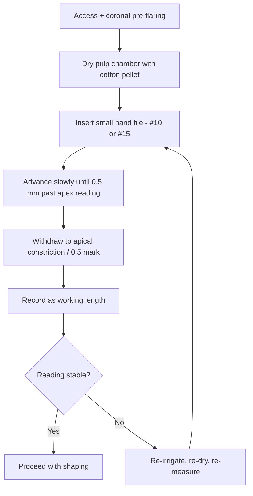

# Apex locators

**Electronic apex locators (EALs)** determine the position of the root canal terminus by measuring electrical properties of the tissues around the file tip. Modern multi-frequency devices are accurate enough that radiographs are rarely needed to confirm working length in straightforward cases.

## How they work

All apex locators are based on the same principle: the impedance between a file inserted into the root canal and a contact on the patient's lip changes as the file approaches the periodontal ligament. Different generations differ in how they measure that change.

### Generations

| Generation | Measurement | Notes |
| --- | --- | --- |
| 1st | Resistance | Single frequency, needs dry canal — obsolete |
| 2nd | Impedance | Single frequency, affected by electrolytes |
| 3rd | Two frequencies, ratio method | More tolerant of wet canals |
| 4th / 5th | Multi-frequency, simultaneous | Current standard, tolerant of irrigants and vital tissue |
| 6th | Multi-frequency + machine learning | Marketing category more than a distinct technology |

Practically: any 4th-generation-or-later device from a reputable manufacturer is clinically accurate. The differences in day-to-day use are about ergonomics and display quality, not fundamental physics.

## Clinical accuracy

Meta-analyses place modern EALs within **±0.5 mm of the minor apical foramen in ~95% of cases**[^kim-meta]. This is better than periapical radiography alone.

Accuracy degrades with:

- Incompletely débrided canals (pulp tissue creates false readings)
- Very wide apices (immature teeth, resorptive defects)
- Metal restorations in contact with the file shaft
- Excessive irrigant in the access cavity (short-circuits the measurement)

## Workflow

## Practical tips

- **Pre-flare the coronal two-thirds before measuring.** This removes most of the pulp tissue that interferes with readings.
- **Dry the pulp chamber** before inserting the file for measurement. A pool of hypochlorite in the chamber will give short or erratic readings.
- **Use the smallest file that binds at the apex.** Oversized files give short readings because the device registers contact with the canal wall, not the terminus.
- **Recheck after irrigation and shaping.** The apical anatomy can shift as debris is removed.
- **Don't trust a reading that moves.** If the display jumps between values, the measurement is unreliable. Fix the conditions (dry, small file, clean canal) and remeasure.

## Confirming radiographically

A confirmation radiograph is justified when:

- The reading is unstable or conflicts with expected root length
- Anatomy is unusual (immature apex, resorption, dilaceration)
- Medicolegal documentation requires it

In routine cases with a stable reading on a well-prepared canal, the evidence does not support mandatory radiographic confirmation[^connert-rct].

## See also

- [Root canal treatment](articles/root-canal-treatment.md)
- Reviewed apex locators: [Woodpex III](reviews/equipment/woodpex-iii.md)

## References

[^kim-meta]: Kim E, Lee SJ. *Electronic apex locator.* Dent Clin North Am. 2004;48(1):35–54.
[^connert-rct]: Connert T, Judenhofer MS, Hülber-J M, et al. *Accuracy of three different electronic apex locators in comparison with microscopic control — an in vitro study.* Clin Oral Investig. 2019;23(4):1829–1838.
